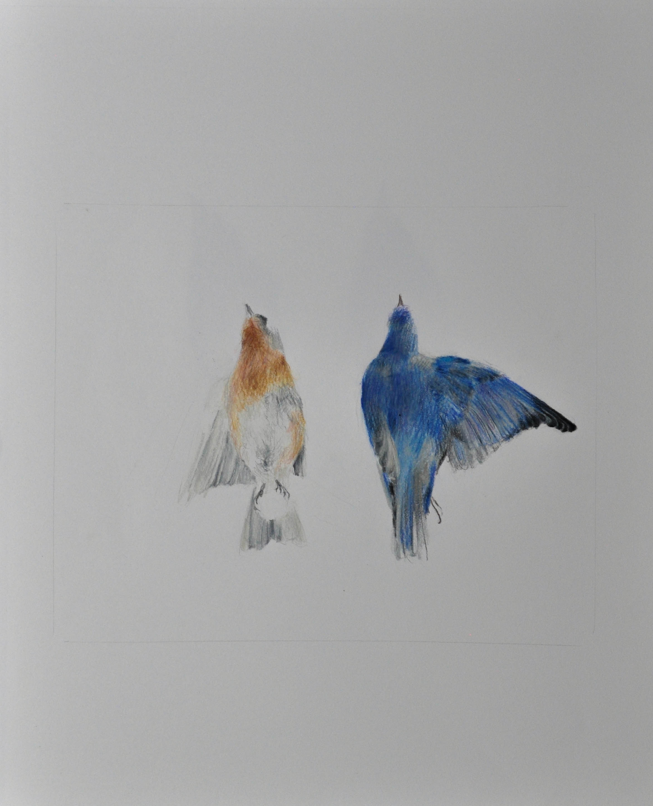

<div align="center">
  <br>
  
  <br/>
  <h1><a href="https://www.instagram.com/colomermarion/?hl=en" rel="nofollow noreferrer noopener" target="_blank">Marion Colomer's website</a></h1>
</div>
<br/>
<p align="center">
  <a href="https://nodejs.org/en/">
    
  </a>
  <a href="https://github.com/prettier/prettier">
    
  </a>
  <a href="https://www.11ty.dev">
    
  </a>
</p>

Website for the artist Marion Colomer. This project is developped with [Eleventy](https://www.11ty.dev).

## Getting Started

### Prerequisites

- [nodeJS](https://nodejs.org/): I recommend using [volta](https://volta.sh/) to install the nodeJS version listed on the badge.

### Standard Installation

1. Clone the repository, ie. `git clone https://github.com/Mcdostone/marion-colomer-website`
1. `npm install` to install dependencies
1. `npm run dev` or `make dev`
1. After few seconds, you should be able to access the website: `https://localhost:8080/`

### Build the website

```bash
# The output will be located in _site/ directory.
make build
```

## Retrieve the old website

[Wayback Machine](https://archive.org/web/web.php) is your friend.

```bash
docker run --rm -it -v $PWD/websites:/websites hartator/wayback-machine-downloader http://marioncolomer.com
```

## Author

- Yann Prono, [@Mcdostone](https://github.com/Mcdostone)
